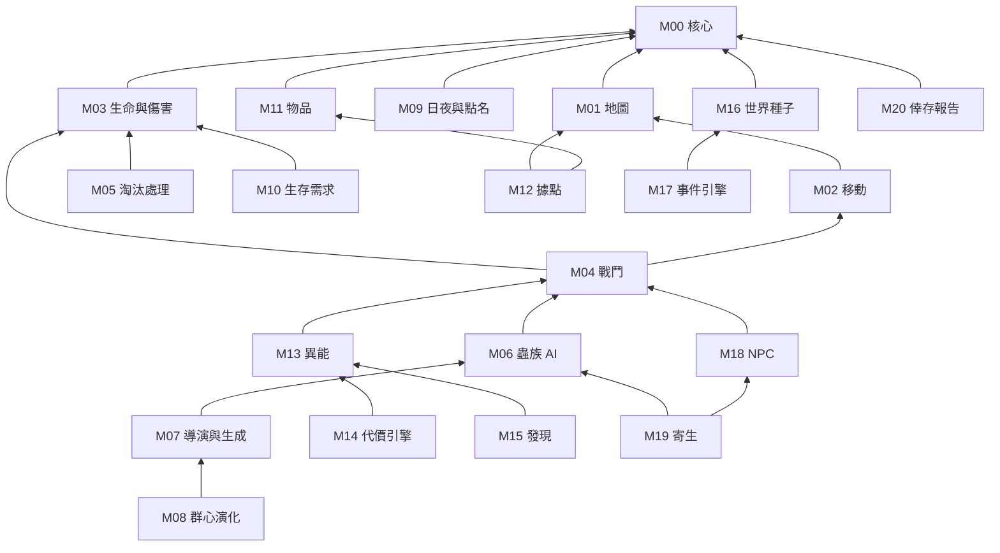

# 02｜模組設計（v0.2）

> **設計文件和程式碼一一對應：** 每個模組就是程式裡的一個資料夾。
> **每個模組都會寫明：** 責任、依賴、發出和接收的事件、版本演進（v1 → v2 → v3），以及在哪一輪實作。
> **規則：** 模組之間只能透過「元件、事件、公開 API」溝通（見 04）。訂閱別的模組發出的事件不算依賴，所以發出事件的模組不需要知道誰在聽。

---

## 1. 模組依賴圖

箭頭表示「依賴於」。只能往下依賴，不能循環。



**刻意的設計：** M20 倖存報告只讀「事件紀錄」，不依賴任何玩法模組。所以報告出錯，不會影響遊戲本身。

---

## 2. 模組卡

### M00 核心（I0）
- **責任：**
  - 世界：實體和元件
  - 系統排程
  - 固定 Tick（每秒 20 次）
  - 命名亂數流
  - 事件匯流排和事件紀錄
  - 序列化：存檔、快照、重播
- **依賴：** 無
- **演進：**
  - v1：以上全部
  - v2：快照只傳差異（I1）
  - v3：空間索引，加速大量蟲的碰撞和感知

### M01 地圖（I0 → I1）
- **責任：** 載入 Tiled 地圖；處理碰撞層、區域標籤（例如宿舍、射擊館、聖域）、生成點。
- **演進：**
  - v1：用程式產生的測試地圖
  - v2：Tiled 畫的校區灰盒
  - v3：室內樓層和門
- **事件：** `ZoneEntered`、`ZoneExited`

### M02 移動（I0）
- **責任：** 移動、碰撞、衝刺。
- **演進：**
  - v1：八方向移動加碰撞
  - v2：閃避翻滾
  - v3：地形效果（蟲膜減速、霧）

### M03 生命與傷害（I2）
- **責任：** 生命值、受傷、擊退、倒地、扶起、死亡。
- **發出事件：** `DamageDealt`、`EntityDowned`、`EntityRevived`、`EntityDied`
- **演進：**
  - v1：生命值、倒地、扶起
  - v2：傷勢狀態（流血、酸蝕）
  - v3：部位傷害（暫不做）

### M04 戰鬥（I2）
- **責任：** 近戰、投擲和射擊、命中判定。
- **發出事件：** `AttackPerformed`
- **演進：**
  - v1：近戰揮擊、投擲物
  - v2：武器資料化（耐久、特性）
  - v3：環境武器（滅火器、水帶）

### M05 淘汰處理（I2，蛻者在擴充池）
- **責任：** 決定玩家倒下或死亡之後發生什麼事。
- **設計：** 用插件介面 `EliminationPolicy`，同一時間只啟用一種策略。
- **演進：**
  - v1「倒地救援 + 隔日歸隊」
  - v2「救援任務」
  - v3「蛻者」
- 詳見第 3.3 節。

### M06 蟲族 AI（I2 → I6）
- **責任：** 個體行為，包括感知和行動。
  - **感知管道：** 視覺、聲音、波動、費洛蒙
  - **行動：** 徘徊、追擊、呼叫同伴、撤退
- **資料驅動：** 每個兵種是一份 JSON。
- **發出事件：** `BugSpawned`、`BugKilled`、`PheromoneMarked`
- **演進：**
  - v1：嗅蟲
  - v2：刃螳（I3）
  - v3：酸甲、擬物蟲（I6）

### M07 導演與生成（I2 → I3）
- **責任：** 計算緊張度，依此分配生成預算、安排波次，並保證每一波之後有喘息時間。
- **接收事件：** `DamageDealt`、`EntityDowned`、`Pulse`、`DayEnded`
- **演進：**
  - v1：固定波次
  - v2：緊張度模型
  - v3：多軸壓力：生態、環境、資源、社會，分別在不同時段推進

### M08 群心演化（I6）
- **責任：** 每天結束時讀取當天的事件紀錄，統計玩家的戰術，再從演化樹挑出反制。
  - **演化樹範例：** 常用火就長出濕甲；據守建築就派鑽地蠕；很少殺生就提高好奇度。
  - **徵兆：** 演化前會有可觀察的跡象，讓玩家有機會預判。
- **發出事件：** `HiveEvolved`
- **演進：**
  - v1：3 種反制
  - v2：群心性格
  - v3：完整演化樹

### M09 日夜與點名（I3）
- **責任：** 時間流逝、日夜切換，以及一天結束時的檢查點：存檔、當日結算、通知群心演化。
- **主題名稱：** 在主題層，這個檢查點叫「晚點名」。
- **發出事件：** `DayStarted`、`NightStarted`、`DayEnded`

### M10 生存需求（I3）
- **演進：**
  - v1：飢餓
  - v2：疲勞、心神
  - v3：體溫、天氣

### M11 物品（I3）
- **責任：** 撿拾、物品欄（6 格）、使用、掉落。
- **發出事件：** `ItemPicked`、`ItemUsed`
- **演進：**
  - v1：食物、醫療包、材料
  - v2：製作
  - v3：共鳴物（帶有隱藏特性的物品，要鑑定才知道效果）

### M12 據點（I3）
- **演進：**
  - v1：路障
  - v2：據點模組（瞭望台、醫護站）
  - v3：指派 NPC 工作

### M13 異能（I4）
- **責任：** 處理異能語法（源、觸發、形態、代價、異變），從原型資料產生每位玩家的異能，判斷觸發條件，執行效果。
- **發出事件：** `AbilityOmen`（不自主發動）、`AbilityUsed`
- **演進：**
  - v1：6 個原型
  - v2：12 個原型和異變
  - v3：共鳴連攜（不同玩家的異能互相作用）

### M14 代價引擎（I4 → I6）
- 詳見第 3.1 節。

### M15 發現（I4 → I8）
- 詳見第 3.2 節。

### M16 世界種子（I5）
- **責任：** 從一個種子決定這一局的平行時空。
- **演進：**
  - v1：交界時刻 3 種、天氣（晴或霧）、裂隙位置 3 處、群心性格 2 種
  - v2 之後再增加選項

### M17 事件引擎（I5）
- **責任：** 管理 storylet 式的事件。每個事件有前置條件、權重和後果。
- **發出事件：** `StoryletTriggered`、`StoryletResolved`
- **演進：**
  - v1：12 個事件
  - 之後依試玩回饋擴充

### M18 NPC（I5）
- **演進：**
  - v1：可以被救援、跟隨玩家
  - v2：有需求、信任和記憶
  - v3：NPC 也有自己的異能

### M19 寄生（I8）
- 詳見第 3.4 節。

### M20 倖存報告（I3 簡易版 → I7 完整版）
- **責任：** 只讀取事件紀錄和最終狀態，產生結算報告。
- **內容：** 評級、稱號、成果、異能揭曉、重要事蹟、倖存者評價、蟲族評價、開放式結局。

### M21 跨局記憶（擴充池）
- **內容：** 檔案室、圖鑑、每日種子。

### 基礎設施（不屬於玩法）
- **N1 網路：** 連線、房間、快照、預測和插值。
- **C1 呈現：** 繪製畫面、HUD、UI、音效。只讀狀態、只送指令，不直接改遊戲狀態。
- **T1 工具：** 除錯面板、重播器、無頭模擬、內容檢查。

---

## 3. 重點系統深入設計

### 3.1 M14 代價引擎：從「消耗」延伸成「取捨」

**一個代價由五個維度組成。** 寫在異能原型的資料檔裡。

| 維度 | 選項 | 例子 |
|---|---|---|
| **類型** | 資源：體力、飢餓、體溫 | 用一次扣 20 體力 |
| | 累積：蟲化值、心神 | 越用越接近失控門檻 |
| | 曝露：波動、噪音、光 | 群心循著波動派兵過來 |
| | 知識：記憶碎片 | 抹掉一則日誌，你會忘記關於自己能力的線索 |
| | 社會：目擊者的恐懼 | 看到你使用異能的 NPC 會對你戒備 |
| | 環境 | 周圍的植物枯萎、裂隙微微擴大 |
| **時機** | 即付、持續、延遲、條件 | 延遲型：當晚發燒或做惡夢 |
| **可見度** | 明示、模糊、隱藏 | 隱藏的代價要到結算時才揭曉 |
| **付出者** | 自己、隊友分攤、周圍的人、世界 | 「共感」把傷勢分給隊友 |
| **縮放** | 固定、過度使用上升、熟練下降、超載 | 見下面的規則 |

**規則：**
1. **反噬：** 付不起代價時仍然可以發動，但會依類型轉換成傷害、失控或隨機副作用。
2. **超載：** 按住施放鍵，主動付 2–3 倍代價，換取更強的效果。風險由玩家自己決定。
3. **熟練：** 使用次數越多、已經理解的要素越多（和 M15 連動），代價越低。
4. **代價可以反過來利用：**
   - 波動可以當誘餌，把蟲引進陷阱。
   - 蟲化值高時，蟲族會猶豫要不要攻擊你。
5. **覺悟**（v3）：永久接受某個代價，例如再也不能使用照明，換取能力上限提升。

**有代價的原型範例：**
- **回溯三秒：** 代價是知識型。每用一次就抹掉一則日誌，所以越依賴它，越難完全理解它。
- **光之哨所：** 代價是曝露型。發光的領域能驅散斥候，卻會引來蛾群。
- **共感：** 代價由隊友分攤。能治療隊友，但傷勢會轉到另一個人身上，需要隊伍協調。

**版本演進：**
- **v1（I4）：** 資源、曝露、累積（蟲化值）三種類型；即付；反噬；超載
- **v2（I6）：** 加入延遲、知識、社會三種類型；熟練
- **v3：** 加入環境類型、隊友分攤、覺悟

**介面：**
- **資料格式：** `CostSpec = { type, amount, timing, visibility, payer, scaling }`
- **公開 API：** `canPay`、`pay`、`backlash`
- **發出事件：** `CostPaid`、`Backlash`、`Pulse`（波動，M07 和 M08 會監聽）、`MemoryLost`（M15 會監聽）

### 3.2 M15 發現：知識鎖的核心

**發現的流程：**

```
徵兆 → 覺醒日誌 → 推理板 → 實驗 → 命名 → 深化 → 真名
```

| 版本 | 內容 |
|---|---|
| v1（I4） | 不自主發動的徵兆；日誌自動記錄；推理板有三個欄位（源、觸發、形態）；實驗判定；三要素都確認後由玩家**命名**，異能變成可以按鍵施放的技能 |
| v2（I6） | 推理板加上代價和異變兩欄；外部輔助：隊友目擊、鑑識分析 |
| v3（I8 以後） | 真名和終極技；土地公廟擲筊（每天一問）；共鳴發現 |

**防挫折設計：**
- 徵兆的出現頻率隨難度調整。
- 理解不完整時，異能還是能用，只是比較弱、比較不穩定。

### 3.3 M05 淘汰處理：「蛻者」是什麼？

> 完整規格見 [specs/M05-molter.md](specs/M05-molter.md)，內容包括淘汰階梯、人性值、好處與壞處、替代方案比較、技術落地。

**它屬於哪一類設計：** 「淘汰後玩法」（post-elimination gameplay），用來解決多人合作遊戲的「**玩家淘汰問題**」（player elimination problem）：一個人先死掉之後只能乾等，那段時間的體驗最差。

**業界常見的解法：**

| 解法 | 說明 | 例子 |
|---|---|---|
| 觀戰 | 死掉的人只能看隊友玩 | 多數射擊遊戲 |
| 救援重生 | 隊友要去某個地點把人救回來 | 《Left 4 Dead》的救援房間 |
| 幽靈模式 | 死者換成另一套能力，留在場上，等待復活 | 《Don't Starve Together》的鬼魂 |
| 陣營轉換 | 死者加入敵方陣營 | 各種「感染模式」自訂玩法 |

**蛻者** 是「陣營轉換」和「救援重生」的混合。死掉或蟲化值滿了的玩家，會變成半人半蟲，換一套能力（可以爬牆、聽得懂蟲語），也換一套限制（進不了聖域、NPC 會怕你），留在同一場遊戲裡繼續玩，而且之後有機會被救回人類。這是一種「**失敗轉化**」：讓失敗產生新的玩法，而不只是損失。

**實作策略：**
- **v1（I2）：**
  1. 倒地後 30 秒內，隊友可以把你扶起來。
  2. 沒被扶起來就死亡，進入觀戰。
  3. 下一次點名時，你以「被找到的倖存者」身分歸隊。異能進度保留，身上的物品會掉落。
  4. 全隊都倒下時，這一局結束。
- **v2：** 救援任務。歸隊不再自動發生，要由隊友前往特定地點把人救回來。
- **v3：** 蛻者。換掉同一個 `EliminationPolicy` 插件就好，不用改其他模組。

### 3.4 M19 寄生：用通用的方式偵測

**感染：** 寄生蜂讓 NPC 暗中被寄生，有一段潛伏期。

**偵測線索（玩家可以觀察到的破綻）：**
- **行為：** 點名時慢半拍、叫不出室友的名字、半夜站在走廊上
- **生理：** 體溫偏低、受傷時不流血
- **動物：** 校犬對他低吼、鴿子一靠近就飛走
- **異能：** 某些異能可以感知寄生

**處置：** 隔離觀察、用血清治療（需要鑑識大樓）、驅逐。每種做法都有後果。

**範圍：** v1 只會寄生 NPC。朋友局的「隱藏寄生玩家」是之後的選項，預設關閉。
