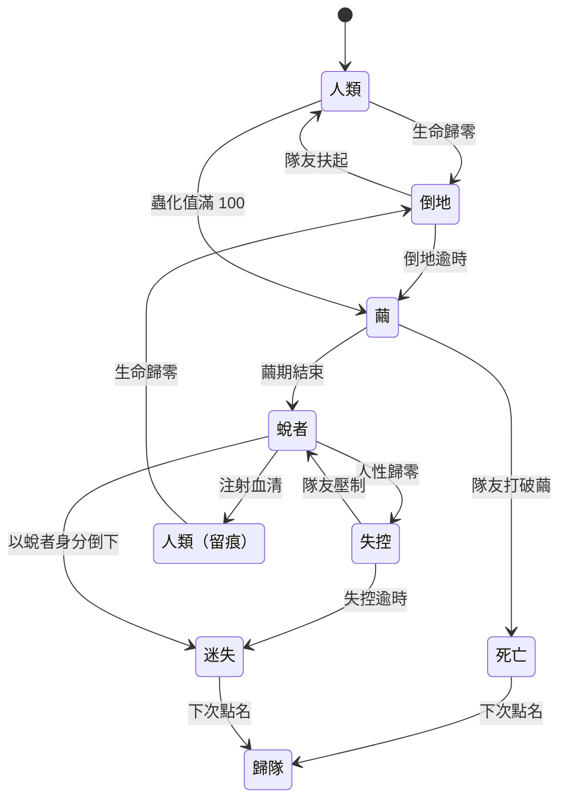

> **已擱置（D-013）。** 這份規格不是現行設計。擱置的原因：太強、太複雜，而且讓死亡比活著更有用。保留在這裡只供日後參考。

# M05 規格：淘汰處理與「蛻者」（v0.3 提案）

> **定位：** 蛻者是 M05「淘汰處理」的 v3。MVP 階段先做 v1（倒地救援 + 隔日歸隊），但從 I0 就預留擴充點。到時候加入蛻者，主要是新增資料和一個小模組，不必改寫現有系統（見第 8 節）。

---

## 1. 一句話

> 死亡不是出局。你會結繭、蛻化成半人半蟲，換一套能力留在同一場遊戲裡；一邊幫隊友，一邊努力不讓自己忘記曾經是人。

- **設計分類：** 淘汰後玩法（post-elimination gameplay）× 陣營轉換（side switch）× 救援重生（rescue respawn）× 失敗轉化（failure as content）。
- **它要解決什麼：** 多人合作遊戲的「玩家淘汰問題」：先死的人只能乾等。
- **它想做到什麼：** 讓失敗產生新的玩法和故事，而且這套機制本身有世界觀上的根據（交融波、蟲化值）。

## 2. 流程：淘汰階梯

每一次失敗都通往一個新的狀態，而不是直接出局。



| 狀態 | 說明 |
|---|---|
| 倒地 | 30 秒內隊友可以把你扶起來，和 MVP 相同 |
| 繭 | 倒地的位置結成一個繭，持續 45 秒。期間你在繭裡選擇**變異**（3 選 1）。隊友可以選擇打破繭，讓你以人類身分死去，或是保護繭直到你蛻化。工蟲會被吸引過來守護繭 |
| 蛻者 | 換一套能力和限制繼續玩（見第 3、4 節） |
| 失控 | 人性歸零時，角色暫時由群心控制，會攻擊隊友。隊友把你打倒（不是殺死）之後，你恢復控制，人性回到 20 |
| 迷失 | 失控太久，或是以蛻者身分再次倒下，角色就永久變成蟲族。之後這個角色會以**菁英敵人**的身分再次出現，使用你的異能的扭曲版本。這就是 v0.1 的「蛻者 Boss」 |
| 歸隊 | 下次點名時，你以另一名倖存者的身分加入：可能是新角色，也可能是接手一名 NPC（見第 6 節） |
| 人類（留痕） | 注射血清後回到人類，但蟲化值從 60 起算，並保留一個**殘留特徵**（例如還能隱約看見費洛蒙）。之後就和一般人類一樣，可以再倒地 |

## 3. 蛻者能做什麼

| 能力 | 內容 | 對隊伍的價值 |
|---|---|---|
| 攀爬 | 能翻過牆、路障，鑽通風管 | 走人類走不了的路，負責偵察 |
| 費洛蒙視覺 | 看得見費洛蒙路徑、巢穴、擬物蟲，也看得出誰被寄生 | **隊伍的眼睛** |
| 蟲語 | 聽得懂蟲族之間的交談，能提前知道下一波從哪裡來 | 預警 |
| 群體接納 | 低階蟲族不會主動攻擊你，直到你攻擊牠們，或是「曝露值」滿了 | 潛入蟲巢、救出被擄走的人、從內部破壞 |
| 異能變異 | 原本的異能變成「蛻變版」。例如靜默之壁變成甲殼之壁；代價改為消耗人性 | 新的探索 |
| 爪擊 | 近戰傷害不錯 | 自保 |
| 誘餌 | 可以帶著蟲群離開隊友身邊 | 掩護 |

**組隊的樣貌：** 人類負責守和打，蛻者負責看、潛入、引開。這就是非對稱合作。

## 4. 蛻者的限制

| 限制 | 理由 |
|---|---|
| 不能使用需要「手」的物品：槍械、醫療包、鑰匙門、製作 | 保留人類的價值，避免有人故意送死來變強 |
| 進不了聖域（土地公廟） | 和蟲族同一條規則。只是「無法靠近」，不描寫神明傷害任何人 |
| NPC 會怕你、躲你，甚至攻擊你；你也不能招募 NPC | 社會壓力。有隊友同行時，NPC 會比較冷靜 |
| 人性會隨時間流失 | 讓蛻者有急迫感，不能永遠當蛻者 |
| 吃蟲屍可以回復體力，但會損失人性 | 強制做出選擇 |
| 生命上限比較低 | 平衡 |

## 5. 人性值：蛻者的核心資源

- **起始值：** 50，上限 100。
- **流失：**
  - 每分鐘 −2
  - 使用蟲族能力
  - 吃蟲屍 −10
  - 待在巢穴附近會流失得更快
- **回復：**
  - 待在隊友身邊時緩慢回復
  - 保護人類（擋下攻擊、救人）
  - 吃人類的食物
  - **點名時答「有」+15**：一天結束集合的時候，蛻者的名字也會被唸到。答了，就是還記得自己是人。這段直接沿用住校生活的元素，不需要任何警察設定
- **門檻：**
  - 人性低於 30：畫面開始出現蟲語的幻聽，操作偶爾不聽使喚
  - 人性歸零：失控（見第 2 節）

## 6. 好處

1. **沒有人坐冷板凳。** 從死亡到重新參與，等待時間接近零。
2. **失敗變成故事。** 例如「你都變成蟲了，還幫我們開門」「最後一次點名，他答『有』」。
3. **非對稱合作。** 同一隊裡出現兩種角色，戰術深度增加。
4. **世界觀一致。** 蟲化值和異能代價有了最終的回收：用太多力量，真的會變成蟲。
5. **情感張力。** 信任（他還是我們這邊的嗎？）、背叛（失控）、救贖（血清）三段都有。
6. **重玩價值。** 變異每次 3 選 1，蛻變版異能也各不相同。
7. **為以後鋪路。** 動態 Boss（迷失的角色）、群心模式（玩家扮演蟲族）都可以沿用同一套機制。

## 7. 壞處與對策

| 壞處 | 說明 | 對策 |
|---|---|---|
| 開發成本高 | 等於多做一種角色類型：操作、動畫、UI、平衡 | 先做「蛻者精簡版」驗證，好玩再擴充；美術用共用的蟲化外觀加調色 |
| 故意送死 | 如果蛻者太強，大家會為了變強而自殺 | 人性流失、不能用道具、NPC 恐懼、繭期很脆弱、死亡會掉落物品；用無頭模擬比較兩種策略的存活率 |
| 死亡失去重量 | 死了也沒關係的話，生存恐怖的張力會下降 | 繭可能被打破；迷失是真的會失去這個角色；全隊都非人類時就觸發「蛻化」結局 |
| 失控很不舒服 | 失去控制權、被朋友打 | 失控時間短（30–60 秒）、有明確的預警、隊友是「壓制」而不是殺死；可以在設定裡關閉失控 |
| 規則變複雜 | 新玩家搞不清楚蛻者能做什麼 | 繭期用 45 秒教學；第一次蛻化時有提示卡 |
| 系統耦合 | 蛻者會碰到很多系統：AI 選目標、NPC、聖域、物品、異能、UI、報告 | 用「特性標籤」和「狀態機」實作，各系統只讀標籤，不寫「如果是蛻者就怎樣」的特例（見第 9 節） |

## 8. 替代方案比較

| 方案 | 做法 | 等待時間 | 死亡重量 | 開發成本 | 世界觀契合 | 需要的模組 |
|---|---|---|---|---|---|---|
| A. 觀戰 + 隔日歸隊（MVP） | 死後觀戰，下次點名回來 | 長 | 中 | **低** | 中 | M03 |
| A+. 觀戰標記 | A 的升級版：觀戰時可以在地圖上標記位置提示隊友 | 長，但有事做 | 中 | 低 | 中 | M03、UI |
| B. 救援任務 | 被擄進巢穴或困在某棟樓，要隊友去救 | 中 | **高** | 中 | 高 | M06、M01 |
| C. 殘響（幽靈） | 化成交融波的殘響：能閃燈、推小物件、留訊息 | 短 | 中 | 中 | 中 | M01、UI |
| D. 操控蟲族 | 死後控制一隻敵方的蟲 | 短 | 低 | 高 | 中 | M06、平衡 |
| E. 接管倖存者 | 死後接手一名你救過的 NPC，連同他的隱藏異能（類似《State of Decay》換角色） | **零** | 高 | 中 | 高 | M18 NPC |
| F. 立即重生 | 幾秒後在檢查點復活 | 短 | 低 | 低 | 低 | M03 |
| **G. 蛻者** | 本文件 | **零** | 中高 | 高 | **最高** | 多數模組 |

**建議：** 這些方案可以組合，不必只挑一個。

| 階段 | 淘汰處理 |
|---|---|
| I2（MVP） | A + A+：便宜，而且保留死亡的重量 |
| I5（有了 NPC 系統） | 加上 E「接管倖存者」：救人就等於多一條命，讓救人更有意義 |
| 蛻者精簡版 | 驗證 G 好不好玩 |
| 完整版 | G 為主；迷失之後接 E 或 A |

**完整版的淘汰階梯：** 倒地 → 繭 → 蛻者 → 迷失 → 接管倖存者／歸隊。

## 9. 技術落地

### 9.1 原則：蛻者不是特例，是「狀態加上標籤」
- 不寫 `if (isMolter)`。
- 蛻者只是一個實體換了「形態」和「特性標籤」。其他系統都只讀標籤，所以會自動產生正確的反應。

### 9.2 從 I0 就要預留的通用元件

| 元件 | 內容 | 一開始誰在用 |
|---|---|---|
| `Faction` | 陣營：human、hive | 玩家、蟲 |
| `Traits` | 特性標籤，例如 `hands`、`climb`、`sanctuaryBlocked` | 玩家（hands）、蟲（sanctuaryBlocked） |
| `Controller` | 由誰控制：player 或 ai | 玩家（player）、蟲（ai） |
| `Form` | 形態：human、downed、cocoon、molted、lost | 玩家 |

**各系統只認標籤：**

| 系統 | 讀什麼 |
|---|---|
| 蟲族 AI 選目標 | 只攻擊 `Faction = human` 的實體；略過帶有 `hiveCamouflage`、且曝露值還沒滿的實體 |
| 地圖的聖域規則 | 擋下所有帶 `sanctuaryBlocked` 的實體。蟲和蛻者用的是同一條規則 |
| 物品 | 資料寫 `requires: ["hands"]`；蛻者沒有 `hands` 標籤，自然就用不了 |
| 移動 | 碰撞遮罩由標籤決定：有 `climb` 就能穿過「可攀爬」圖層 |
| NPC 感知 | 看到帶 `npcFear` 的實體就會害怕 |
| **失控** | 把 `Controller` 從 player 換成 ai，`Faction` 暫時改成 hive。蟲族 AI 會直接接手這個身體，不需要另外寫一套程式 |

### 9.3 淘汰處理寫成資料驅動的狀態機

```ts
// content/elimination/molter.json 描述狀態轉移；policy 只決定哪些轉移是啟用的
interface Transition { from: Form; to: Form; on: TriggerKind; when?: Condition; effects: Effect[] }
interface EliminationPolicy { id: string; enabled: Transition[] }
```

- **MVP 的策略** 只啟用 human → downed → dead → rejoin 這幾條轉移。
- **升級成蛻者** 就是啟用更多轉移，再加上資料，不需要改寫狀態機。
- **每次狀態轉移都會發出事件：** `EntityCocooned`、`EntityMolted`、`ControlLost`、`ControlRegained`、`EntityReverted`、`EntityLostForever`。
  - 倖存報告會讀這些事件，寫出像「D4 03:12 你蛻化了」的重要事蹟。
  - 群心演化也會參考這些事件。

### 9.4 形態和變異都是資料

```json
// content/forms/molted.json
{
  "id": "molted",
  "traits": ["climb", "pheromoneSight", "hearHive", "hiveCamouflage", "sanctuaryBlocked", "npcFear"],
  "removeTraits": ["hands"],
  "stats": { "maxHp": 80, "speedMul": 1.15 },
  "humanity": { "start": 50, "decayPerMin": 2, "rollCall": 15, "eatBug": -10, "nearAllyPerMin": 1 },
  "attacks": ["claw"],
  "mutationChoices": 3
}
```

- **變異：** `content/mutations/*.json`，每個變異只負責「加減特性和數值」。
- **蛻變版異能：** 在異能原型裡加一個 `moltedVariant` 欄位。

### 9.5 網路：每位玩家看到的不一樣
- **快照分視角：** 伺服器組快照時，透過 `visibleTo(實體, 觀看者)` 決定要送哪些資料。
  - 費洛蒙圖層只送給有 `pheromoneSight` 的玩家。
  - 蟲語只送給有 `hearHive` 的玩家，走私人事件頻道。
  - 好處是畫面一致，也防止作弊。
- **這個掛鉤點在 I1 就要預留。** 一開始先讓它全部回傳 true。
- **失控時：** 伺服器忽略該玩家的輸入，客戶端顯示「失控」畫面和抵抗提示。
- **美術：** 客戶端依照 `Form` 選擇 sprite。蛻者先用共用的蟲化外觀加上玩家顏色的調色，節省美術成本。

### 9.6 新增的模組
- **M05b 人性**：一個小系統，負責人性的流失、回復、門檻。
- 除此之外，主要是新增資料（形態、變異、轉移）、UI（人性環、蟲語字幕、繭期的變異選擇）和美術。

### 9.7 測試
- **狀態機：** 每一條轉移都有單元測試。
- **情境測試：**
  - 蛻者穿過 20 隻嗅蟲，在沒有攻擊的情況下不會被攻擊
  - 蛻者進不了聖域
  - 人性歸零 → 控制權換成 AI → 隊友壓制 → 恢復控制
  - 繭被打破就變成死亡
- **黃金重播：** 至少一份包含蛻化過程的重播檔。
- **平衡模擬：** 機器人分成「正常求生」和「故意送死」兩組，各跑 500 局，確認故意送死**不會**提高勝率。
- **開關：** 房間設定 `eliminationPolicy` 可以選 `spectateRejoin`、`rescue`、`takeover`、`molter`。你和朋友可以直接比較不同方案。

### 9.8 時程
- **I0–I3：** 把第 9.2 節的通用元件、I1 的快照分視角掛鉤、I2 的資料驅動狀態機做進去。這幾乎不增加 MVP 的工作量。
- **蛻者精簡版：** 約 1 輪。只做攀爬、費洛蒙視覺、群體接納三個能力，加上人性流失和點名回復。不做失控、變異、血清。拿來驗證「好不好玩」和「大家會不會故意送死」。
- **完整版：** 約 1–2 輪。加上失控、迷失 Boss、變異 3 選 1、血清任務、蛻變版異能。

## 10. 倖存報告裡的呈現

- **重要事蹟：** 「D4 03:12　你在射擊館前結繭」「D5 21:00　點名時，你用沙啞的聲音答了『有』」
- **稱號：** 「從繭裡回來的人」「最後一次答有的蛻者」「隊伍的眼睛」
- **蟲族的評價：** 「此個體曾短暫屬於我們。它聞起來仍像人類。群心無法理解它為何回去。」

## 11. 待決事項

1. 蛻者精簡版要排在 MVP 之後的第一輪，還是照原計畫放在擴充池？
2. 失控預設要不要開啟？朋友局之間對「被朋友打」的接受度可能不一樣。
3. 迷失的角色要由 AI 控制，還是讓原本的玩家自己操控？後者是 PvP 元素，可以設成選項。
